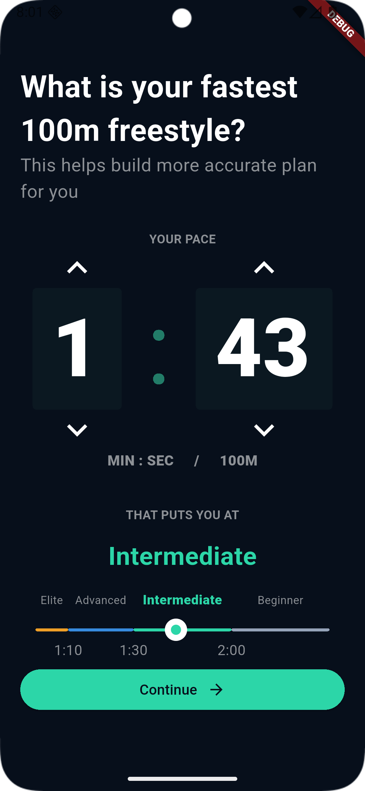
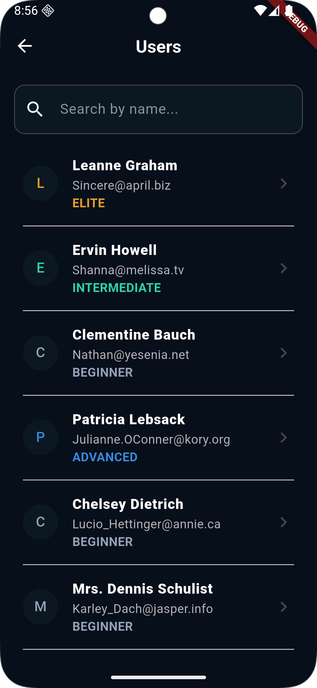
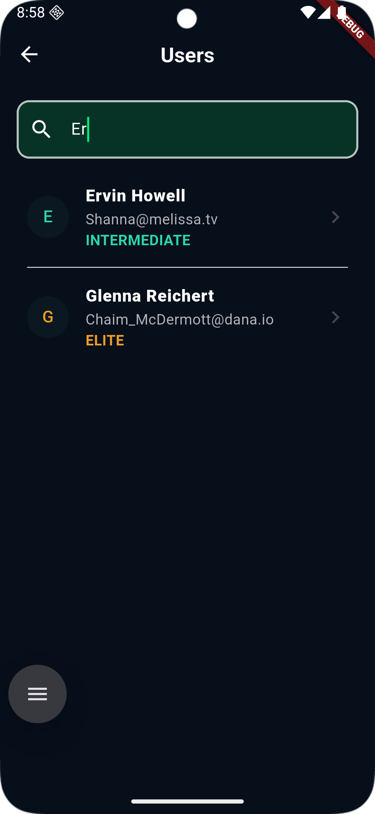
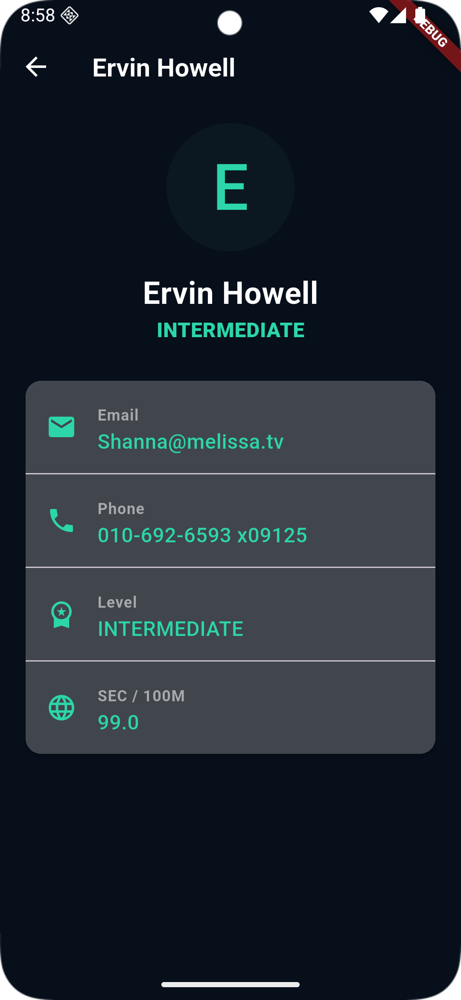

# swim_success

## test_task

## prologue
### STACK:
#### - riverpod with hooks (to not boilerplate code)
#### - dio (just love it)
#### - talker as riverpod logger
#### - fpdart (for ERRORS)
#### - default generators like json_ser.../freezed/riverpod_generator
#### - very_good_analysis as lits

### DOCS:
i have chosen feature-first clean architecture, created in my lib folder 3 folders (core, feature, shared).

Core folder contains things like canvas/extension/failure/router/theme/services etc.

Feature contains features which split entire app on not reliable parts, each feature have folders like presentation/domain/data.

- presentation == Set<Folder>[screens, notifier, widget];
- domain == Set<Folder>[entity, enum, mapper, abstracts repos, usecases];
- data == Set<Folder>[model, datasource implementation, abstract datasource, repos implementation, mappers, etc.];

Shared contains as well as feature contains presentation/domain/data, but this folders in reliable by other features

for DI i using riverpod providers for every bit of business logic

## TASK 1

### DOCS:

1 task took 2 notifiers, first one pace_notifier, and seconds one is post_pace_notifier

pace_notifier responsible for entity that contains double seconds and PaceStateEnum such as slider value, UI color components and pace input

[PaceStateEnum]:

    /// pace state
    enum PaceStateEnum {
        /// beginner
        beginner,
        /// intermediate
        intermediate,
        /// advanced
        advanced,
        /// elite
        elite,
    }

[pace input] is Form() with 2 TextFormField(), that defined as timer_pace_widget and time_cell_widet in project,
this part receiving pace value in TextFormField cells and changing pace value by methods defined in notifier via arrows or cells

[UI color] changing UI colors and styles via switch pattern matching

[slider value] is slider with ticks underneath (1:10, 1:30, 2:00) and user level (beginner, intermediate, advance, elite) over itself, i have made it with Stack( Slider (with custom canvas thumb) + Column with Expanded ), this part read pace value at very beginning and change pace value by dragging thumb on it 

#### time range:

- 45 - 240 sec
- slider range 0 - 1 (double)

pace_level_slider (widget) defines convertors in both directions:

from slider range to seconds:

    int _valToSec(double val) {
        if (val >= 2 / 3) {
            // 2:00 - 4:00 (120 - 240 sec)
            return (120 + (val - 2 / 3) * 360).round();
        } else if (val >= 1 / 3) {
            // 1:30 - 2:00 (90 - 120 sec)
            return (90 + (val - 1 / 3) * 90).round();
        } else if (val >= 1 / 9) {
            // 1:10 - 1:30 (70 - 90 sec)
            return (70 + (val - 1 / 9) * 90).round();
        } else {
            // 0:45 - 1:10 (45 - 70 sec)
            return (45 + val * 225).round();
        }
    }

from seconds to slider range:

    double _secToVal(double sec) {
        if (sec >= 120) {
            // 120 - 240 sec -> 2/3 до 1.0
            return 2 / 3 + (sec - 120) / 360;
        } else if (sec >= 90) {
            // 90 - 120 sec -> 1/3 до 2/3
            return 1 / 3 + (sec - 90) / 90;
        } else if (sec >= 70) {
            // 70 - 90 sec -> 1/9 до 1/3
            return 1 / 9 + (sec - 70) / 90;
        } else {
            // 45 - 70 sec -> 0.0 до 1/9
            return (sec - 45) / 225;
        }
    }

post_pace_notifier responsible for post request of pace seconds of user to https://jsonplaceholder.typicode.com/posts which was made up via dio that defined in core/services/http_service.dart and responsible to display showDialog when its loading/success/error after pressing continue button

### UI:

note: Have used SafeArea + Padding + SingleChildScrollView, there one more button on bottom that is not visible on screen but reachable by scroll ("I don't know my pace, skip this" button)

## TASK 2

### DOCS:

2 task took 2 notifiers, first one user_list_notifier, and seconds one is query_notifier

user_list_notifier responsible for List<UserEntity> with users from API and updates of state on 2 screens that comes through [http_remote_user_ds.dart] → [http_user_repository_impl] → [fetch_user_list_use_case] → [user_list_notifier]

query_notifier responsible for notifying [filter_user_use_case] with new symbols

fetch_user_list_use_case returns value of method fetchListOfUserEntities of repository [http_user_repository_impl]

filter_user_case watching [user_list_notifier] and [query_notifier] for updates, if [user_list_notifier] return data then [filter_user_case] returns filtered data by names of users that contains value of [query_notifier]

fetch_user_by_id_use_case watching [user_list_notifier] and taking argument id, and return user that match user.id == id

### UI:

User list screen :

User details screen

